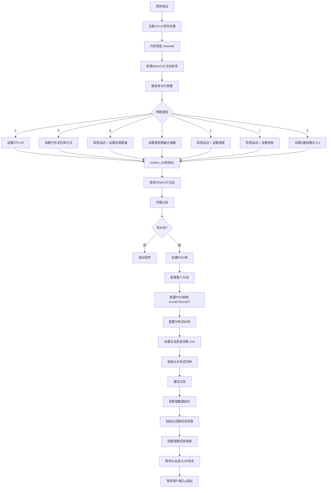
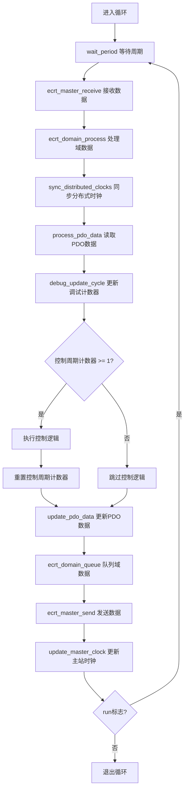
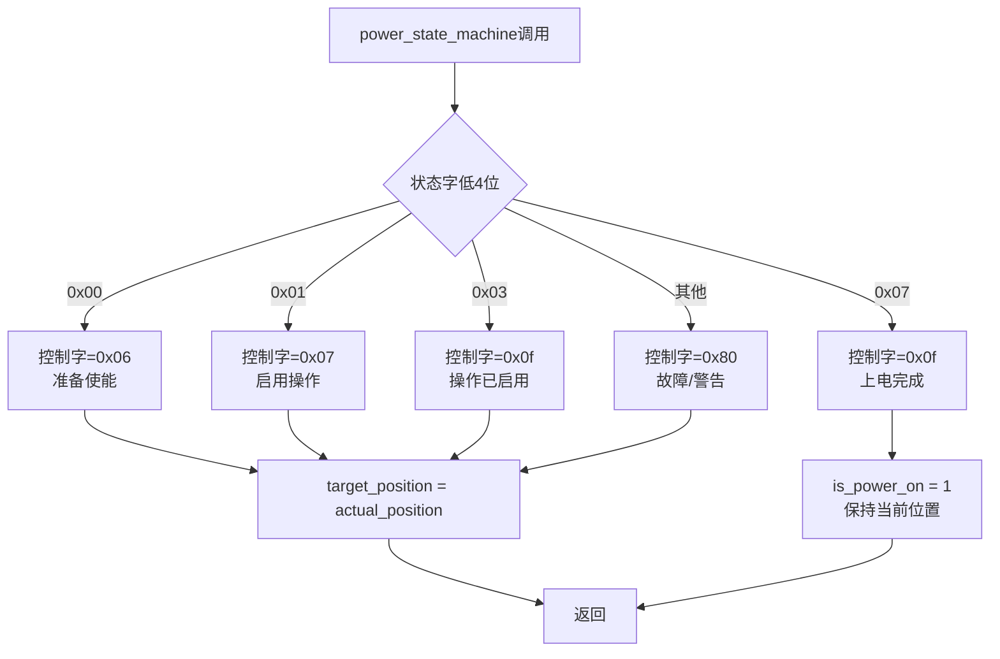
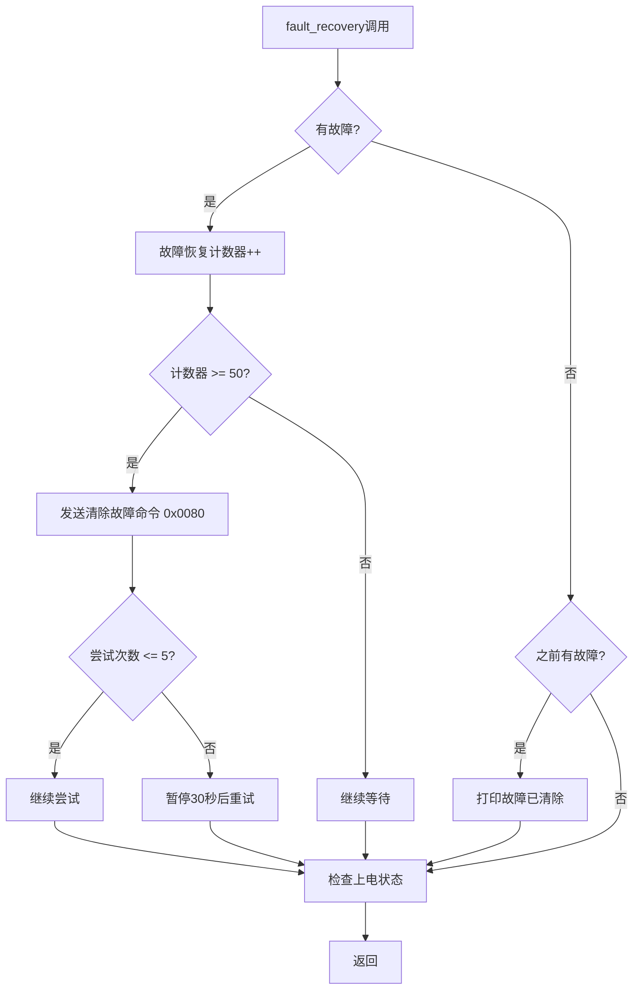
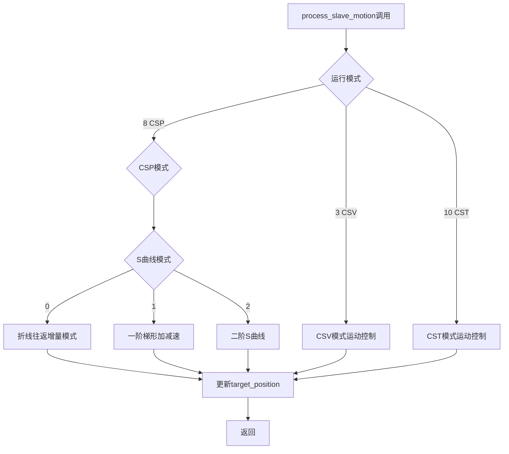

# EtherCAT PDO实时通讯软件流程图

## 1. 系统架构概览

```
┌─────────────────────────────────────────────────────────┐
│                   主程序 (main)                          │
│  - 参数解析 (-c, -d, -p, -i, -v, -t, -s)               │
│  - EtherCAT主站初始化                                    │
│  - 从站扫描和PDO配置（固定0x1607/0x1A07）                │
│  - 创建周期任务线程                                       │
└─────────────────────────────────────────────────────────┘
                        ↓
┌─────────────────────────────────────────────────────────┐
│              周期任务线程 (cyclic_task)                  │
│  - 实时调度设置 (SCHED_FIFO, 优先级90)                    │
│  - CPU亲和性设置                                          │
│  - 周期时间：EtherCAT周期1ms，控制周期1ms                 │
└─────────────────────────────────────────────────────────┘
                        ↓
        ┌───────────────────────────────┐
        │    EtherCAT周期循环 (1ms)      │
        └───────────────────────────────┘
```

## 2. 主程序初始化流程 (main函数)



### 2.1 参数说明

| 参数 | 含义 | 默认值 | 说明 |
|------|------|--------|------|
| `-c` | CPU ID | - | 设置任务运行的CPU核心 |
| `-d` | 分布式时钟方法 | 0 | 0=从站参考时钟, 1=主站参考时钟 |
| `-p` | 启用运动+位移参数 | - | 往返运动位移距离（脉冲数，1000-10000000） |
| `-i` | 每周期最大增量 | 0 | 每控制周期最大增量脉冲数（0=禁用，1-100000） |
| `-v` | CSV模式目标速度 | - | 速度模式目标速度（cnt，-10000000到10000000） |
| `-t` | CST模式目标转矩 | - | 转矩模式目标转矩（-32767到32767） |
| `-s` | S曲线模式 | 0 | 0=折线往返增量, 1=一阶梯形, 2=二阶S曲线 |

### 2.2 从站配置流程

```
for (每个从站 i) {
    1. 获取从站信息 (vendor_id, product_code)
    2. 判断是否为伺服从站
    3. 如果是伺服:
       - 清除默认PDO分配
       - 配置PDO映射（固定RW模板 0x1607/0x1A07）
       - 根据-v/-t参数决定CST/CSV/CSP模式
       - 注册PDO条目到域
       - 配置SDO参数 (速度、加速度、减速度)
    4. 配置分布式时钟 (DC)
}
```

## 3. 周期任务流程 (cyclic_task函数)

### 3.1 初始化阶段

```
1. 设置CPU亲和性 (绑定到最后一个CPU核心)
2. 设置实时调度 (SCHED_FIFO, 优先级90)
3. 周期时间配置:
   - EtherCAT周期 = 1ms (1000000ns)
   - 控制周期 = 1ms (1000us)
   - 每个控制周期 = 1个EtherCAT周期
4. 初始化第一个睡眠时间
```

### 3.2 主循环结构



### 3.3 控制周期执行逻辑（每个EtherCAT周期执行）

```
if (control_cycle_counter >= 1) {
    for (每个伺服从站) {
        if (is_move) {
            // 根据-v/-t参数设置运行模式
            if (target_torque != 0) {
                operation_mode = 10;  // CST模式
            } else if (target_velocity_cnt != 0) {
                operation_mode = 3;   // CSV模式
            } else {
                operation_mode = 8;   // CSP模式（默认）
            }
            set_operation_mode(index, operation_mode);
            
            // 只有在通信正常时才更新状态机
            if (comm_ok) {
                power_state_machine(index, 1); // 上电状态机
                fault_recovery(index);         // 故障检测和恢复
            }
            // 运动控制算法
            process_slave_motion(index);
        }
    }
    control_cycle_counter = 0;
}
```

## 4. 通信层 (每个EtherCAT周期执行)

### 4.1 数据接收流程

```
process_pdo_data() {
    for (每个从站) {
        读取状态字 (0x6041)      → motion_data[i].status_word
        读取实际位置 (0x6064)     → motion_data[i].actual_position
        读取运行模式显示 (0x6061) → motion_data[i].control_mode_acutal
        读取实际速度 (0x606c)     → motion_data[i].actual_velocity
        （CST模式）读取实际转矩 (0x6077) → motion_data[i].actual_torque
    }
}
```

### 4.2 数据发送流程

```
update_pdo_data() {
    for (每个从站) {
        写入控制字 (0x6040)        → motion_data[i].control_word
        写入运行模式 (0x6060)     → motion_data[i].control_mode
        （CSP模式）写入目标位置 (0x607a) → motion_data[i].target_position
        （CSV模式）写入目标速度 (0x60ff) → motion_data[i].target_velocity
        （CST模式）写入目标转矩 (0x6071) → motion_data[i].target_torque
    }
}
```

## 5. 控制层（每个EtherCAT周期执行）

### 5.1 状态机逻辑 - set_operation_mode()

```
set_operation_mode(slv_num, mode) {
    motion_data[slv_num].control_mode = mode;  // 设置运行模式
}
```

### 5.2 状态机逻辑 - power_state_machine()



**状态转换序列:**
```
0x00 (未就绪) 
  → 0x06 → 0x01 (就绪)
  → 0x07 → 0x03 (操作启用)
  → 0x0f → 0x07 (运行使能)
```

### 5.3 故障检测逻辑 - fault_recovery()



### 5.4 运动控制逻辑 - process_slave_motion()



**运动模式说明:**
- **CSP模式（默认）**：
  - s=0: 折线往返增量模式（三角形）
  - s=1: 一阶梯形加减速（梯形速度曲线）
  - s=2: 二阶S曲线（加速度平滑变化）
- **CSV模式**：速度控制，使用-v参数设置目标速度
- **CST模式**：转矩控制，使用-t参数设置目标转矩

## 6. 数据流图

```
┌─────────────────────────────────────────────────────────────┐
│                    EtherCAT从站                              │
│  - 状态字 (0x6041)                                          │
│  - 实际位置 (0x6064)                                        │
│  - 实际速度 (0x606c)                                        │
│  - 实际转矩 (0x6077)                                        │
└─────────────────────────────────────────────────────────────┘
                        ↑ 接收 ↓ 发送
┌─────────────────────────────────────────────────────────────┐
│               PDO通信层 (每个1ms周期)                        │
│  process_pdo_data()  ← 读取从站数据                          │
│  update_pdo_data()   → 写入控制数据                          │
└─────────────────────────────────────────────────────────────┘
                        ↑ 读取 ↓ 写入
┌─────────────────────────────────────────────────────────────┐
│            motion_data[] 数据结构                            │
│  - status_word (状态字)                                      │
│  - actual_position (实际位置)                                │
│  - target_position (目标位置)                                │
│  - target_velocity (目标速度)                                │
│  - target_torque (目标转矩)                                  │
│  - control_word (控制字)                                     │
│  - control_mode (运行模式)                                   │
└─────────────────────────────────────────────────────────────┘
                        ↑ 更新 ↓ 计算
┌─────────────────────────────────────────────────────────────┐
│           控制层（每个EtherCAT周期执行）                      │
│  power_state_machine() → 更新 control_word                    │
│  set_operation_mode() → 更新 control_mode                    │
│  process_slave_motion() → 更新 target_position/velocity/torque│
└─────────────────────────────────────────────────────────────┘
```

## 7. 关键变量说明

### 7.1 全局变量

| 变量名 | 类型 | 说明 |
|--------|------|------|
| `g_cycletime_ns` | unsigned int | EtherCAT周期时间(纳秒)，固定1000000ns(1ms) |
| `g_control_cycle_time_us` | unsigned int | 控制周期时间(微秒)，固定1000us(1ms) |
| `max_diffPosition` | int | 往返运动距离(脉冲数)，通过 `-p` 参数设置 |
| `pulses_per_control_cycle` | int | 每控制周期最大增量脉冲数，通过 `-i` 参数设置 |
| `target_velocity_cnt` | int | CSV模式目标速度，通过 `-v` 参数设置 |
| `target_torque` | int | CST模式目标转矩，通过 `-t` 参数设置 |
| `s_curve_mode` | int | S曲线模式，通过 `-s` 参数设置（0-2） |
| `slave_count` | unsigned int | 从站数量 |
| `is_move` | int | 是否启用运动标志 |
| `pdo_choice` | int | PDO模板选择，固定为7（0x1607/0x1A07） |

### 7.2 运动控制数据结构

```c
struct motion_control_data {
    unsigned short control_word;      // 控制字 (0x6040)
    unsigned short status_word;       // 状态字 (0x6041)
    int target_position;              // 目标位置 (0x607a)
    int actual_position;             // 实际位置 (0x6064)
    int target_velocity;             // 目标速度 (0x60ff)
    int actual_velocity;             // 实际速度 (0x606c)
    short target_torque;              // 目标转矩 (0x6071)
    short actual_torque;              // 实际转矩 (0x6077)
    unsigned char control_mode;       // 运行模式 (0x6060)
    unsigned char control_mode_acutal;// 实际运行模式 (0x6061)
    int is_power_on;                 // 上电标志
    int is_first_in;                 // 首次进入标志
    int is_reverse;                  // 反向标志
};
```

## 8. 时间线图

### 8.1 EtherCAT周期 (1ms, 1000Hz)

```
时间轴: 0ms ── 1ms ── 2ms ── 3ms ── ... ── 1000ms
        │     │     │     │              │
        ├─接收 ├─接收 ├─接收 ├─接收        ├─接收
        ├─处理 ├─处理 ├─处理 ├─处理        ├─处理
        ├─控制 ├─控制 ├─控制 ├─控制        ├─控制
        ├─发送 ├─发送 ├─发送 ├─发送        ├─发送
```

### 8.2 控制周期（1ms，与EtherCAT周期同步）

```
时间轴: 0ms ── 1ms ── 2ms ── 3ms ── ... ── 1000ms
        │     │     │     │              │
        ├─状态机逻辑 ├─状态机逻辑 ├─状态机逻辑 ├─状态机逻辑    ├─状态机逻辑
        ├─运动控制算法 ├─运动控制算法 ├─运动控制算法 ├─运动控制算法    ├─运动控制算法
        └─更新目标位置 └─更新目标位置 └─更新目标位置 └─更新目标位置    └─更新目标位置
```

## 9. 运动模式说明

### 9.1 CSP模式 - 折线往返增量模式（s=0）

```
初始状态:
  target_position = actual_position + max_diffPosition

运动过程:
  电机运动 → 到达目标 → 等待 → 反向运动

反向运动:
  target_position = actual_position - max_diffPosition

循环往复...
```

### 9.2 CSP模式 - 一阶梯形加减速（s=1）

```
使用一阶梯形加减速算法生成平滑轨迹（梯形速度曲线）
- 加速段：线性加速
- 匀速段：保持最大速度
- 减速段：线性减速
```

### 9.3 CSP模式 - 二阶S曲线（s=2）

```
使用二阶S曲线算法生成平滑轨迹
- 加速度平滑变化（梯形加速度曲线）
- 速度曲线为二次S形
- 位置曲线为三次S形
```

### 9.4 CSV模式 - 速度控制

```
使用-v参数设置目标速度
  target_velocity = target_velocity_cnt
  持续输出目标速度，电机按设定速度运行
```

### 9.5 CST模式 - 转矩控制

```
使用-t参数设置目标转矩
  target_torque = target_torque
  持续输出目标转矩，电机按设定转矩运行
```

## 10. 关键函数调用关系

```
main()
  ├─ example_parse_arguments()        // 解析命令行参数
  ├─ example_init_ethercat_master()   // 初始化EtherCAT主站
  ├─ ecrt_master_create_domain()     // 创建域
  ├─ pdo_set_configure_slave_pdo()   // 配置PDO（固定0x1607/0x1A07）
  ├─ example_configure_servo_motion_params() // 配置伺服参数
  ├─ example_activate_master_and_start_threads() // 激活主站并启动线程
  └─ example_wait_for_user_exit()    // 等待用户退出

cyclic_task()
  ├─ wait_period()                    // 等待周期
  ├─ ecrt_master_receive()            // 接收数据
  ├─ ecrt_domain_process()            // 处理域数据
  ├─ sync_distributed_clocks()       // 同步分布式时钟
  ├─ process_pdo_data()               // 读取PDO数据
  │   └─ EC_READ_U16/S32()           // 读取状态字、位置等
  ├─ set_operation_mode()            // 设置运行模式
  ├─ power_state_machine()            // 上电状态机
  ├─ fault_recovery()                 // 故障检测和恢复
  ├─ process_slave_motion()           // 运动控制算法
  │   ├─ motion_process_slave_motion_csv() // CSV模式
  │   ├─ motion_process_slave_motion_cst() // CST模式
  │   └─ motion_process_slave_motion_custom/trapezoidal/2s() // CSP模式
  ├─ update_pdo_data()                // 更新PDO数据
  │   └─ EC_WRITE_U16/S32()          // 写入控制字、目标位置等
  └─ ecrt_master_send()               // 发送数据
```

## 11. PDO配置说明

### 11.1 PDO模板（固定0x1607/0x1A07）

**RxPDO (0x1607):**
- 0x6040: 控制字 (16bit)
- 0x6060: 运行模式 (8bit)
- 0x607A: 目标位置 (32bit) - CSP模式
- 0x60FF: 目标速度 (32bit) - CSV模式
- 0x6071: 目标转矩 (16bit) - CST模式
- 0x60FE:01: 数字输出 (32bit)
- 0x60B1: 速度前馈 (32bit) - CSP模式

**TxPDO (0x1A07):**
- 0x6041: 状态字 (16bit)
- 0x6061: 运行模式显示 (8bit)
- 0x6064: 实际位置 (32bit)
- 0x606C: 实际速度 (32bit)
- 0x6077: 实际转矩 (16bit) - CST模式
- 0x60FD: 数字输入 (32bit)

## 12. 注意事项

1. **PDO模板**: 固定为0x1607/0x1A07（RW模板）

2. **EOE功能**: 主站编译时必须禁用EOE（--disable-eoe），否则会导致PDO通讯异常

3. **周期时间**: EtherCAT周期1ms，控制周期1ms，两者同步

4. **运动控制**: 所有伺服从站都会执行运动控制，使用-p、-v或-t参数时自动启用

5. **S曲线模式**: 支持0-2（折线、一阶梯形、二阶S曲线）

## 13. 模块功能说明

### 13.1 igh_example.c / igh_example.h

**功能**: 主程序模块，负责程序初始化和周期任务调度

**主要功能**:
- 命令行参数解析（-c, -d, -p, -i, -v, -t, -s）
- EtherCAT主站初始化和从站扫描
- 从站配置和PDO映射配置
- 创建和管理周期任务线程
- 信号处理（Ctrl+C安全退出）
- 伺服状态初始化和检查

**关键函数**:
- `main()`: 程序入口
- `example_parse_arguments()`: 解析命令行参数
- `example_init_ethercat_master()`: 初始化EtherCAT主站
- `example_activate_master_and_start_threads()`: 激活主站并启动线程
- `example_cyclic_task()`: 周期任务主循环
- `example_catch_signal()`: 信号处理函数

### 13.2 motion.c / motion.h

**功能**: 运动控制模块，负责伺服运动控制逻辑

**主要功能**:
- PDO数据读写（状态字、位置、速度、转矩等）
- 伺服上电状态机控制
- 故障检测和恢复
- 运行模式设置（CSP/CSV/CST）
- 运动控制算法（折线、一阶梯形、二阶S曲线）
- 增量限制模式

**关键函数**:
- `motion_init()`: 初始化运动控制数据
- `motion_process_pdo_data()`: 读取PDO数据
- `motion_update_pdo_data()`: 更新PDO数据
- `motion_power_state_machine()`: 上电状态机
- `motion_fault_recovery()`: 故障检测和恢复
- `motion_set_operation_mode()`: 设置运行模式
- `motion_process_slave_motion()`: 运动控制主函数
- `motion_process_slave_motion_custom()`: 折线往返增量模式
- `motion_process_slave_motion_csp_trapezoidal()`: 一阶梯形加减速
- `motion_process_slave_motion_csp_2s()`: 二阶S曲线
- `motion_process_slave_motion_csv()`: CSV模式控制
- `motion_process_slave_motion_cst()`: CST模式控制

### 13.3 pdo_set.c / pdo_set.h

**功能**: PDO配置模块，负责从站PDO映射配置

**主要功能**:
- PDO分配（清除和添加PDO到同步管理器）
- PDO映射配置（RW模板0x1607/0x1A07）
- 根据运行模式配置不同的PDO映射
- 注册PDO条目到域

**关键函数**:
- `pdo_set_configure_slave_pdo()`: 配置从站PDO（主函数）
- `pdo_set_clear_pdo_assign()`: 清除并重新分配PDO
- `pdo_set_add_pdo_mapping()`: 添加PDO映射条目
- `pdo_set_configure_rw_template_csp()`: 配置CSP模式PDO映射
- `pdo_set_configure_rw_template_csv()`: 配置CSV模式PDO映射
- `pdo_set_configure_rw_template_cst()`: 配置CST模式PDO映射

### 13.4 dc.c / dc.h

**功能**: 分布式时钟模块，负责EtherCAT分布式时钟同步

**主要功能**:
- 分布式时钟初始化
- 主站时钟更新
- 从站时钟同步
- 周期等待和同步

**关键函数**:
- `dc_init()`: 初始化分布式时钟
- `dc_config_slave_dc()`: 配置从站分布式时钟
- `dc_wait_period()`: 等待周期
- `dc_sync_distributed_clocks()`: 同步分布式时钟
- `dc_update_master_clock()`: 更新主站时钟
- `dc_sys_time_ns()`: 获取系统时间（纳秒）

### 13.5 trajectory_planning.c / trajectory_planning.h

**功能**: 轨迹规划模块，负责生成平滑运动轨迹

**主要功能**:
- 一阶梯形加减速轨迹生成（梯形速度曲线）
- 二阶S曲线轨迹生成（加速度平滑变化）
- 轨迹点数组管理

**关键函数**:
- `trajectory_planning_generate_1s_curve()`: 生成一阶梯形加减速轨迹
- `trajectory_planning_generate_2s_curve()`: 生成二阶S曲线轨迹

### 13.6 模块依赖关系

```
igh_example.c
  ├─ 依赖 motion.h (运动控制)
  ├─ 依赖 pdo_set.h (PDO配置)
  ├─ 依赖 dc.h (分布式时钟)
  └─ 依赖 igh_example.h (数据结构定义)

motion.c
  ├─ 依赖 trajectory_planning.h (轨迹规划)
  ├─ 依赖 dc.h (分布式时钟)
  └─ 依赖 igh_example.h (数据结构定义)

pdo_set.c
  └─ 依赖 igh_example.h (数据结构定义)

dc.c
  └─ 依赖 igh_example.h (数据结构定义)

trajectory_planning.c
  └─ 依赖 trajectory_planning.h (函数声明)
```

## 14. 总结

### 14.1 系统架构

- **通信层**: 每个EtherCAT周期(1ms)执行，保证实时性
- **控制层**: 每个EtherCAT周期(1ms)执行，与通信层同步
- **运动模式**: 支持CSP/CSV/CST三种模式，CSP模式支持三种轨迹规划算法

### 14.2 功能特性

- **多模式支持**: CSP/CSV/CST三种运行模式
- **轨迹规划**: CSP模式支持折线、一阶梯形、二阶S曲线
- **增量限制**: 支持-i参数限制每周期增量
- **所有从站**: 所有伺服从站都会执行运动控制
